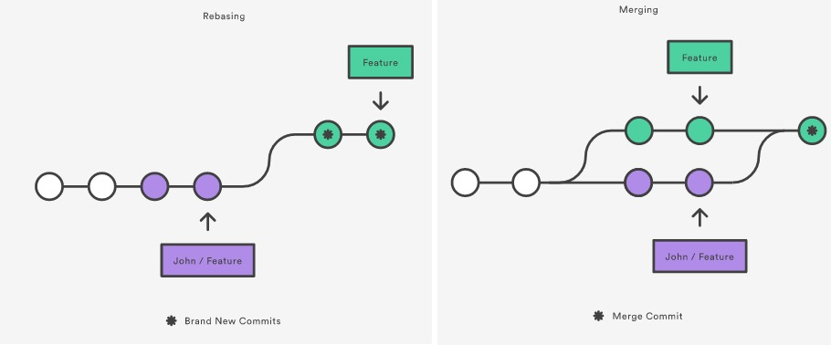

# Git 常用知识总结

总结一下常用的 git 方法，和一些自己的思考。

- 基本用法
- 进阶用法

## 基本用法

首先，我们如果要在 github 上修改代码，通常的用法是：

- git clone github/xxx 克隆仓库。
- git checkout -b feature/xxx 新建自己的分支。
- 修改代码。
- git add xxx 暂存代码。
- git commit -m 'feat: xxx' 把暂存区的所有修改提交到分支上。
- git push 推送到远程仓库。
- 在 github 上提交 pull request 。
- 合并后删除 feature/xxx 分支。

可以说，这个步骤适用于绝大多数开发场景，对于新手来说非常友好。

### 基本 API

上文的操作也不是万能的，我们在开发时很有可能遇到：代码回滚、合并冲突、查看提交记录等问题，这个时候，可以使用以下几个命令：

- git status 查看状态。
- git diff 查看工作区和版本库里面最新版本的区别。
- git log 查看提交记录。
- git reflog 查看每一次命令记录。
- git reset --hard commit_id 切换到指定提交版本。
- git revert HEAD 发起一个新的 commit，用来撤销最后一次 commit。
  - git revert 不能操作文件
- git stash 将当前改动先存起来。git stash pop 释放之前存入的改动。

### 基本分支管理

如果是单人开发，分支管理也许没那么重要，如果是一个团队，那么分支管理就特别重要了。

良好的分支管理可以减少代码冲突，让上线流程更加清晰，分享一个分支开发案例：

- master 线上代码分支。
- develop 主开发分支。
  - 当无项目开发时，和 master 分支保持一致。
  - 当有项目开发时，会包含正在开发的项目代码。
- feature/xxx 个人开发分支。
  - 从 develop 分支上拉取代码，进行功能开发。
  - 开发完成后，合并到 develop 分支。
- release 预发布分支。
  - 从 develop 分支上拉取代码，交给测试去测。
  - 测试发现比较大的 bug，在 feature 分支上修改后，合到 develop 分支上，在重新拉取。
  - 测试发现的小 bug，直接在 release 分支上修改。
  - 合并到 master 和 develop 分支上。
- hotfix 线上紧急修复分支。
  - 从 master 分支拉取，修改代码
  - 测试完毕后，直接合回 master 和 develop 分支。

要实现这些操作步骤，我们得知道以下几个命令：

- 查看分支：git branch
- 创建分支：git branch [name]
- 切换分支：git checkout [name]
- 创建 + 切换分支：git checkout -b [name]
- 合并某分支到当前分支：git merge [name]
- 删除分支：git branch -d [name]
- 建立本地分支和远程分支的关联：git branch --set-upstream branch-name origin/branch-name

Ok，到目前为止，这些 git 命令已经满足大部分的需求了，在多人开发的项目中，只要做好明确分工，减少代码冲突，就不会有什么大问题。

## 进阶用法

基本用法满足了我们 80% 的需求，剩下的 20% 则可以提高我们的 git 使用效率。

例如：开发时如果出现了以下问题，我们应该怎么办？

- 怎么获取其他分支的 commit？
- 怎么合并多个 commit？
- 如何优化提交流水线？

第一个问题其实很好做，直接使用 cherry-pick 命令就好了。

```bash
git cherry-pick commit_id
```

我们根据 commit_id 就能把其他分支的一个或多个 commit 合到当前分支上来。

### 合并多个 commit

如果要合并最后 5 次提交记录为 1 次提交记录，可以先撤销过去的 5 个 commit，然后再建一个新的。

```bash
git reset HEAD~5
git add .
git commit -am "这是合并后的 commit msg"
git push --force
```

使用 git rebase 也可以达到同样的效果。

git rebase 命令的 i 参数表示互动（interactive），这时 git 会打开一个互动界面，进行下一步操作。互动界面中，先列出当前分支最新的几个 commit（越下面越新）。

每个 commit 前面有一个操作命令，默认是 pick，表示该行 commit 被选中，要进行 rebase 操作。还有一些其他操作命令：

- pick：正常选中。
- reword：选中，并且修改提交信息。
- edit：选中，rebase 时会暂停，允许你修改这个 commit。
- squash：选中，会将当前 commit 与上一个 commit 合并。
- fixup：与 squash 相同，但不会保存当前 commit 的提交信息。
- exec：执行其他 shell 命令。

有了交互页面，我们就能手动对这些 commit 进行合并、删除了。

```bash
# 合并最后 5 个 commit
git rebase -i HEAD~5
```

#### 优化提交流水线

在 git 中有一个重要的概念：流水线。

我们可以把 git 中的每一个分支想象成一条流水线。每一次 commit 都会在流水线上产生一个记录，流水线的头部指向最新的 commit。不同的分支控制着不同的流水线，可以通过 git merge 或者 git rebase 将流水线合并在一起。

git rebase 和 git merge 都可以用来合并分支，但合并方式不相同。

- git merge 是将要合并的分支流水线和当前分支流水线汇合成后一条新的流水线。
- git rebase 是将要合并的分支流水线，直接接到当前分支的流水线上。



图中可以看到，git rebase 过后的分支是一条流水线，而 git merge 会是两条流水线汇合成成一条。

我们要怎么选择用 merge 还是 rebase ？

- 下游分支更新上游分支内容的时候使用 rebase
- 上游分支合并下游分支内容的时候使用 merge
- 更新当前分支的内容时一定要使用 --rebase 参数

例如：上游分支 master，基于 master 分支拉出来一个开发分支 dev，在 dev 上开发了一段时间后要把 master 分支提交的新内容更新到 dev 分支，此时切换到 dev 分支，使用 git rebase master。

等 dev 分支开发完成了之后，要合并到上游分支 master 上的时候，切换到 master 分支，使用 git merge dev。

## 参考链接

- [Git Rebase 原理以及黄金准则详解](https://segmentfault.com/a/1190000005937408)
- [Git rebase vs merge 详解](https://www.cnblogs.com/kidsitcn/p/5339382.html)
- [Git 使用规范流程](http://www.ruanyifeng.com/blog/2015/08/git-use-process.html)
- [Git 使用 rebase 和 merge 的正确姿势](https://zhuanlan.zhihu.com/p/34197548)
