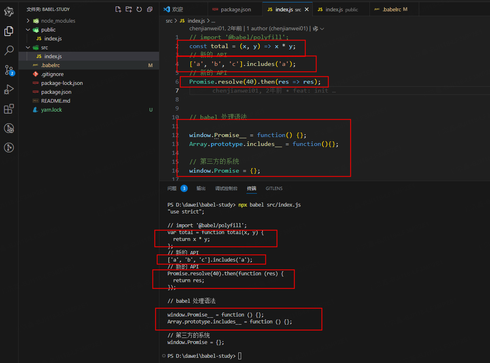
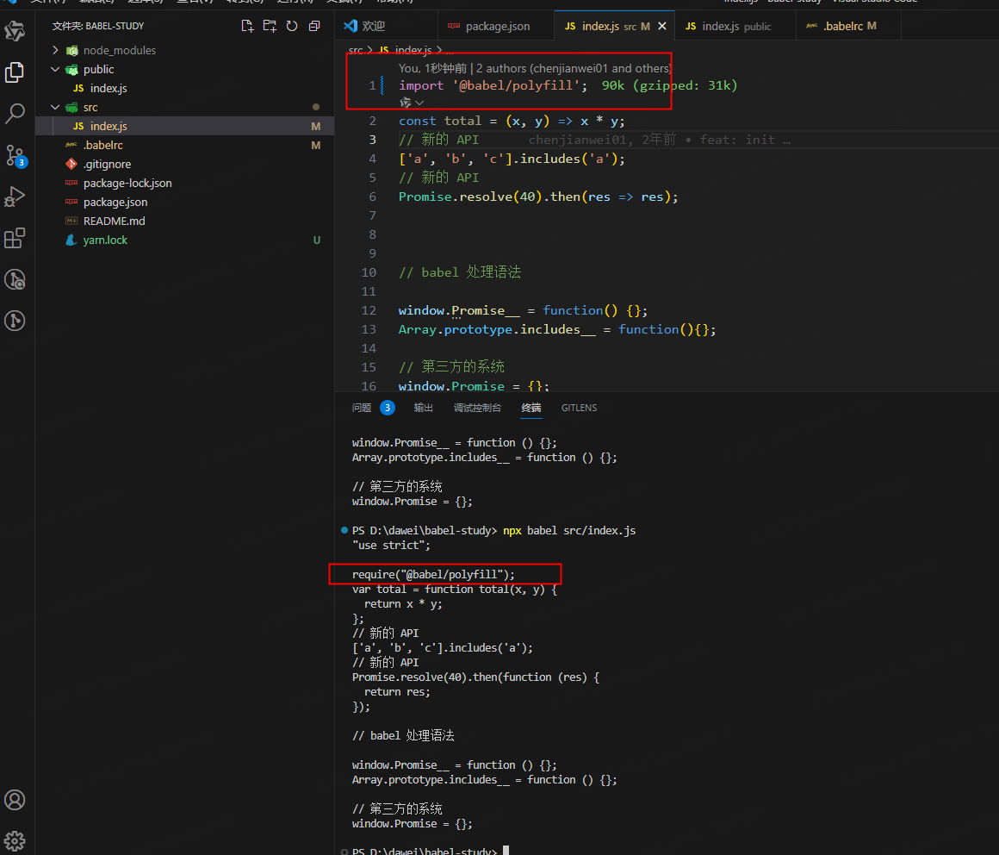
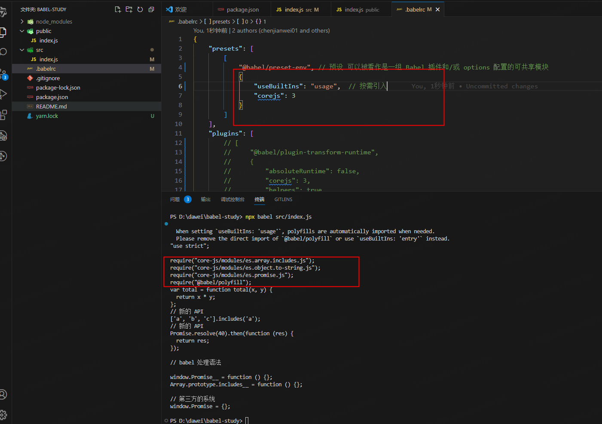
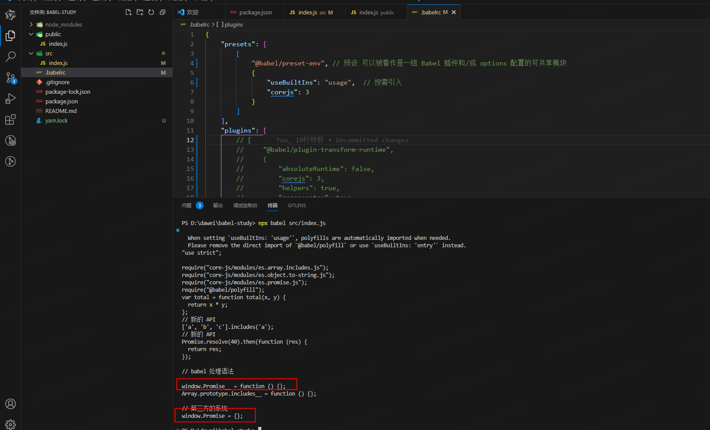
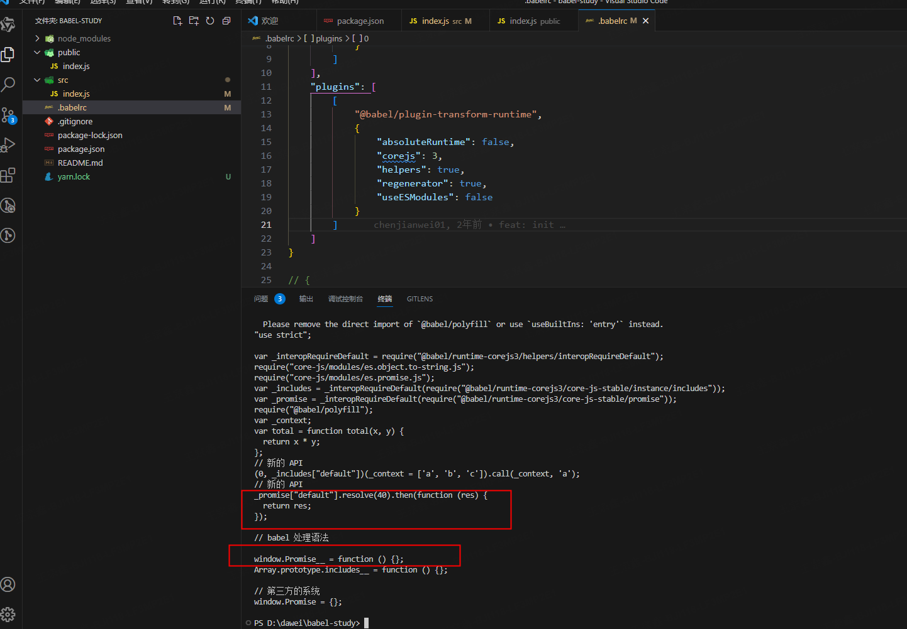

## 前言

Babel 是一个工具链，主要用于将采用 ECMAScript 2015+ 语法编写的代码转换为向后兼容的 JavaScript 语法，以便能够运行在当前和旧版本的浏览器或其他环境中

## 环境搭建和基本配置

.babelrc.js

```javascript
{
    "presets": [
        [
            "@babel/preset-env", // 预设 可以被看作是一组 Babel 插件和/或 options 配置的可共享模块
        ]
    ],
    "plugins": [
    ]
}
```

package.json

```json
{
  "name": "babel7-study",
  "version": "1.0.0",
  "description": "",
  "main": "index.js",
  "scripts": {
    "test": "echo \"Error: no test specified\" && exit 1"
  },
  "keywords": [],
  "author": "",
  "license": "ISC",
  "devDependencies": {
    "@babel/cli": "^7.17.10",
    "@babel/core": "^7.17.10",
    "@babel/plugin-transform-runtime": "^7.17.10",
    "@babel/preset-env": "^7.17.10"
  },
  "dependencies": {
    "@babel/polyfill": "^7.12.1",
    "@babel/runtime": "^7.17.9"
  }
}
```

## babel-polyfill（补丁 要按需引入）

> 什么是 `babel-polyfill`?  
> 很早之前就有了，是一个补丁  
> `core-js`（处理高级的语法）和 `regenerator` (处理`generator`)
> `babel-polyfill` 是两者集合

> Babel 7.4 版本以后 `babel-polyfill` 废弃  
> 推荐使用 `core-js` 和 `regenerator`
>
> `babel` 不处理模块化(webpack 来处理)，不处理 api，只是解析语法，需要引入第三方的包（补丁）去兼容，第三方的补丁需要按需引入
> `babel-polyfill` 按需引入
>
> - 文件大
> - 用什么引入什么，按需引入
>
> babel 不会处理新的 api，只是处理语法（转成浏览器能识别的低版本的语法）
> 解决办法，引入`babel-polyfill` `import '@babel/polyfill';`
> babel 不处理模块化（交给 webpack 处理）
> `babel-polyfill`中包含了很多补丁，用的时候需要按需引入，就需要增加配置

babelrc.js

```json
{
  "presets": [
    [
      "@babel/preset-env",
      {
        "useBuiltIns": "usage", // 按需引入补丁
        "corejs": 3
      }
    ]
  ],
  "plugins": []
}
```





## babel-polyfill 的问题和 babel-runtime(避免污染全局变量)

- `babel-polyfill`会污染全局变量
- 自己独立的系统 没问题
- 如果要开发一个开源的 `library` 可能有问题 ，使用 `babel-runtime`

```js
const sum = (a, b) => a + b;

// 新的 API
Promise.resolve(100).then((data) => data);

// 新的 API
[10, 20, 30].includes(20);

// 语法，符合 ES5 语法规范
// 不处理模块化（webpack）

// 污染全局环境
// window.Promise1 = function() {}
// Array.prototype.includes1 = function () {}

// 使用方
// window.Promise = 'abc'
// Array.prototype.includes = 100

// es6 generate函数（异步函数）  目前都用 async await 这种方式
function* run() {
  console.log('one');
  yield 'one';
  console.log('two');
  yield 'two';
}
```

```json
{
  "presets": [
    [
      "@babel/preset-env",
      {
        "useBuiltIns": "usage",
        "corejs": 3
      }
    ]
  ],
  "plugins": [
    [
      "@babel/plugin-transform-runtime",
      {
        "absoluteRuntime": false,
        "corejs": 3,
        "helpers": true,
        "regenerator": true,
        "useESModules": false
      }
    ]
  ]
}

// {
//     "presets": [
//         [
//             "@babel/preset-env",
//             {
//                 "useBuiltIns": "usage",
//                 "corejs": 3
//             }
//         ]
//     ],
//     "plugins": [
//     ]
// }
```



