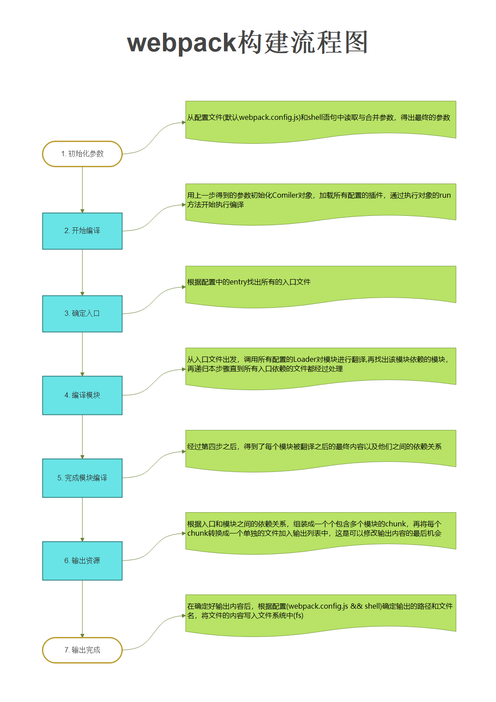

🏷: #webpack

## 一、运行流程



`webpack` 的运行流程是一个串行的过程，它的工作流程就是将各个插件串联起来

**在运行过程中会广播事件，插件只需要监听它所关心的事件，就能加入到这条`webpack`机制中，去改变`webpack`的运作，使得整个系统扩展性良好**

从启动到结束会依次执行以下三大步骤：

- 初始化流程：从配置文件和 `Shell` 语句中读取与合并参数，并初始化需要使用的插件和配置插件等执行环境所需要的参数
- 编译构建流程：从 Entry 发出，针对每个 Module 串行调用对应的 Loader 去翻译文件内容，再找到该 Module 依赖的 Module，递归地进行编译处理
- 输出流程：对编译后的 Module 组合成 Chunk，把 Chunk 转换成文件，输出到文件系统


### 初始化流程

从配置文件和 `Shell` 语句中读取与合并参数，得出最终的参数

配置文件默认下为`webpack.config.js`，也或者通过命令的形式指定配置文件，主要作用是用于激活`webpack`的加载项和插件

关于文件配置内容分析，如下注释：

```javascript
var path = require('path');
var node_modules = path.resolve(__dirname, 'node_modules');
var pathToReact = path.resolve(node_modules, 'react/dist/react.min.js');

module.exports = {
  // 入口文件，是模块构建的起点，同时每一个入口文件对应最后生成的一个 chunk。
  entry: './path/to/my/entry/file.js'，
  // 文件路径指向(可加快打包过程)。
  resolve: {
    alias: {
      'react': pathToReact
    }
  },
  // 生成文件，是模块构建的终点，包括输出文件与输出路径。
  output: {
    path: path.resolve(__dirname, 'build'),
    filename: '[name].js'
  },
  // 这里配置了处理各模块的 loader ，包括 css 预处理 loader ，es6 编译 loader，图片处理 loader。
  module: {
    loaders: [
      {
        test: /\.js$/,
        loader: 'babel',
        query: {
          presets: ['es2015', 'react']
        }
      }
    ],
    noParse: [pathToReact]
  },
  // webpack 各插件对象，在 webpack 的事件流中执行对应的方法。
  plugins: [
    new webpack.HotModuleReplacementPlugin()
  ]
};
```

`webpack` 将 `webpack.config.js` 中的各个配置项拷贝到 `options` 对象中，并加载用户配置的 ` plugins`

完成上述步骤之后，则开始初始化`Compiler`编译对象，该对象掌控者`webpack`声明周期，不执行具体的任务，只是进行一些调度工作

```javascript
class Compiler extends Tapable {
    constructor(context) {
        super();
        this.hooks = {
            beforeCompile: new AsyncSeriesHook(["params"]),
            compile: new SyncHook(["params"]),
            afterCompile: new AsyncSeriesHook(["compilation"]),
            make: new AsyncParallelHook(["compilation"]),
            entryOption: new SyncBailHook(["context", "entry"])
            // 定义了很多不同类型的钩子
        };
        // ...
    }
}

function webpack(options) {
  var compiler = new Compiler();
  ...// 检查options,若watch字段为true,则开启watch线程
  return compiler;
}
...
```

`Compiler` 对象继承自 `Tapable`，初始化时定义了很多钩子函数

### 编译构建流程

根据配置中的 `entry` 找出所有的入口文件

```javascript
module.exports = {
  entry: "./src/file.js",
};
```

初始化完成后会调用`Compiler`的`run`来真正启动`webpack`编译构建流程，主要流程如下：

- `compile` 开始编译
- `make` 从入口点分析模块及其依赖的模块，创建这些模块对象
- `build-module` 构建模块
- `seal` 封装构建结果
- `emit` 把各个 chunk 输出到结果文件

#### compile 编译

执行了`run`方法后，首先会触发`compile`，主要是构建一个`Compilation`对象

该对象是编译阶段的主要执行者，主要会依次下述流程：执行模块创建、依赖收集、分块、打包等主要任务的对象

#### make 编译模块

当完成了上述的`compilation`对象后，就开始从`Entry`入口文件开始读取，主要执行`_addModuleChain()`函数，如下：

```javascript
_addModuleChain(context, dependency, onModule, callback) {
   ...
   // 根据依赖查找对应的工厂函数
   const Dep = /** @type {DepConstructor} */ (dependency.constructor);
   const moduleFactory = this.dependencyFactories.get(Dep);

   // 调用工厂函数NormalModuleFactory的create来生成一个空的NormalModule对象
   moduleFactory.create({
       dependencies: [dependency]
       ...
   }, (err, module) => {
       ...
       const afterBuild = () => {
        this.processModuleDependencies(module, err => {
         if (err) return callback(err);
         callback(null, module);
           });
    };

       this.buildModule(module, false, null, null, err => {
           ...
           afterBuild();
       })
   })
}
```

过程如下：

`_addModuleChain`中接收参数`dependency`传入的入口依赖，使用对应的工厂函数`NormalModuleFactory.create`方法生成一个空的`module`对象

回调中会把此`module`存入`compilation.modules`对象和`dependencies.module`对象中，由于是入口文件，也会存入`compilation.entries`中

随后执行`buildModule`进入真正的构建模块`module`内容的过程

#### build module 完成模块编译

这里主要调用配置的`loaders`，将我们的模块转成标准的`JS`模块

在用` Loader` 对一个模块转换完后，使用 `acorn` 解析转换后的内容，输出对应的抽象语法树（`AST`），以方便 `Webpack `后面对代码的分析

从配置的入口模块开始，分析其 `AST`，当遇到`require`等导入其它模块语句时，便将其加入到依赖的模块列表，同时对新找出的依赖模块递归分析，最终搞清所有模块的依赖关系

### 输出流程

#### seal 输出资源

`seal`方法主要是要生成`chunks`，对`chunks`进行一系列的优化操作，并生成要输出的代码

`webpack` 中的 `chunk` ，可以理解为配置在 `entry` 中的模块，或者是动态引入的模块

根据入口和模块之间的依赖关系，组装成一个个包含多个模块的 `Chunk`，再把每个 `Chunk` 转换成一个单独的文件加入到输出列表

#### emit 输出完成

在确定好输出内容后，根据配置确定输出的路径和文件名

```javascript
output: {
    path: path.resolve(__dirname, 'build'),
        filename: '[name].js'
}
```

在 `Compiler` 开始生成文件前，钩子 `emit` 会被执行，这是我们修改最终文件的最后一个机会

从而`webpack`整个打包过程则结束了

## 构建流程

1. 初始化参数。获取用户在 webpack.config.js 文件配置的参数
2. 开始编译。初始化 compiler 对象，注册所有的插件 plugins，插件开始监听 webpack 构建过程的生命周期事件，不同环节会有相应的处理，然后开始执行编译。
3. 确定入口。根据 webpack.config.js 文件的 entry 入口，开始解析文件构建 ast 语法树，找抽依赖，递归下去。
4. 编译模块。递归过程中，根据文件类型和 loader 配置，调用相应的 loader 对不同的文件做转换处理，在找出该模块依赖的模块，递归本操作，直到项目中依赖的所有模块都经过了本操作的编译处理。
5. 完成编译并输出。递归结束，得到每个文件结果，包含转换后的模块以及他们之前的依赖关系，根据 entry 以及 output 等配置生成代码块 chunk
6. 打包完成。根据 output 输出所有的 chunk 到相应的文件目录

### 小结


## 参考文献

- https://github.com/Cosen95/blog/issues/48
- https://developer.aliyun.com/article/61047
