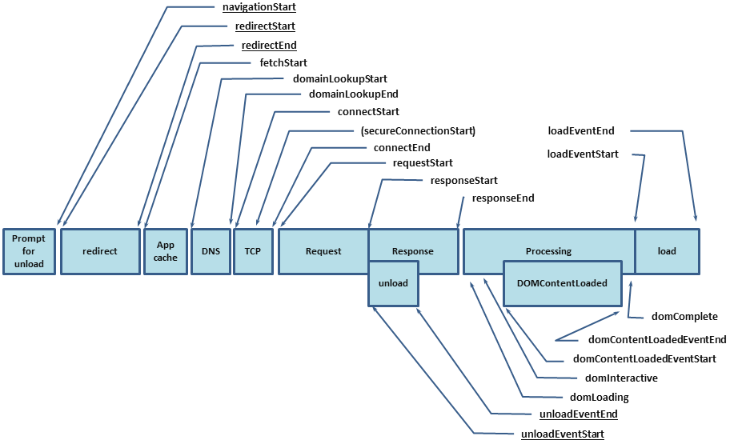
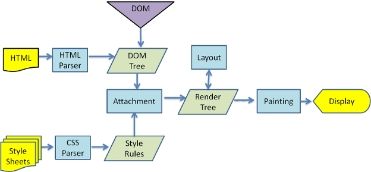

# 前端性能优化

我们先来看一下页面渲染流程图，每个阶段的用时可以在 `performance.timing` 里查询。



从图中我们可以看出，浏览器在得到用户请求之后，经历了下面这些阶段：重定向 → 拉取缓存 → dns 查询 → 建立 tcp 连接 → 发起请求 → 接收响应 → 处理 html 元素 → 元素加载完成。

- 网络传输性能优化
  - 浏览器缓存
  - 使用 http2
  - 资源打包压缩
    - js 压缩
    - html 压缩
    - css 压缩
  - 图片资源优化
    - 不要在 html 里缩放图像
    - 使用雪碧图（css sprite）
    - 使用字体图标（iconfont）
    - 使用 webp
  - 使用 cdn
  - 使用预加载
- 页面渲染性能优化
  - 浏览器渲染过程（webkit）
  - dom 渲染层与 gpu 硬件加速
  - 重排与重绘
- 其他优化
  - pc 端
  - 移动端
  - 前后端同构

## 网络传输性能优化

我们常将网络性能优化措施归结为三大方面：**减少请求数**、**减小请求资源大小**、**提升网络传输速率**。

### 浏览器缓存

浏览器在向服务器发起请求前，会先查询本地是否有相同的文件，如果有，就会直接拉取本地缓存，我们先看看浏览器处理缓存的策略。

.png)

浏览器默认的缓存是放在内存中的，但内存里的缓存会因为进程的结束或者说浏览器的关闭而被清除，如果存在硬盘里就能够被长期保留下去。很多时候，我们在 network 面板中各请求的 size 项里，会看到两种不同的状态：_from memory cache_ 和 _from disk cache_，前者指缓存来自内存，后者指缓存来自硬盘。而控制缓存存放位置的是我们在服务器上设置的 etag 字段。在浏览器接收到服务器响应后，会检测响应头部，如果有 etag 字段，那么浏览器就会将本次缓存写入硬盘中。

### 使用 HTTP2

我们都知道，在一次 http 请求中，底层会通过 tcp 建立连接。而 tcp 协议存在 3 次握手，4 次挥手阶段，这些机制保证了 tcp 的可靠性，但降低了传输效率，为了解决这个问题，我们可以使用 http2 来增加传输时候效率。

http2 相比 http1 主要有以下几点优化：

- 多路复用
  - 多个 http 复用一个 tcp 连接，减少 tcp 握手时间。
- 压缩头部
  - 常用的头部字段保存在表里，传输时只需要传递索引值即可。
- 服务器端推送
  - 服务器根据页面内容，主动把页面需要的资源传给客户端，减少请求数。

### 资源打包压缩

我们之前所作的浏览器缓存工作，只有在用户第二次访问我们的页面才能起到效果，如果要在用户首次打开页面就实现优良的性能，必须对资源进行优化。

#### 压缩 JS 代码

在 webpack 的 production 模式中，会自动压缩 js 代码。

```js
optimization: {
  minimizer: [
    new UglifyJsPlugin({
      cache: true,
      parallel: true,
      sourceMap: true // set to true if you want JS source maps
    }),
    ...Plugins
  ];
}
```

#### 压缩 HTML 代码

使用 html-webpack-plugin 中的 minify 进行压缩。

```js
new HtmlWebpackPlugin({
  minify: {
    removeComments: true,
    collapseWhitespace: true,
    removeRedundantAttributes: true,
    useShortDoctype: true,
    removeEmptyAttributes: true,
    removeStyleLinkTypeAttributes: true,
    keepClosingSlash: true,
    minifyJS: true,
    minifyCSS: true,
    minifyURLs: true
  },
  chunksSortMode: "dependency"
});
```

#### 压缩 CSS 代码

使用 cssnano 压缩 css。在 postcss.config.js 中进行配置。

```js
const cssnano = require("cssnano");
module.exports = {
  plugins: [cssnano]
};
```

### 图片资源优化

刚刚我们介绍了资源打包压缩，只是停留在了代码层面，而在我们实际开发中，真正占用了大量网络传输资源的，并不是这些文件，而是图片，如果你对图片进行了优化工作，你就能立刻看见明显的效果。

#### 不要在 HTML 里缩放图像

很多开发者可能会有这样的错觉，为了能让用户觉得图片更加清晰，本来为了显示 200x200 的图片，却使用 400x400 的图片，其实不然，在普通的显示器上，用户并不会感到缩放后的大图更加清晰，但这样做会导致网页加载时间变长，同时照成带宽浪费。所以，当你需要用多大的图片时，就在服务器上准备好多大的图片，尽量固定图片尺寸。

:::tip
你可能不知道，一张 200KB 的图片和 2M 的图片的传输时间会是 200m 和 12s 的差距。
:::

#### 使用雪碧图（CSS Sprite）

雪碧图的概念大家一定在生活中经常听见，其实雪碧图是减小请求数的显著运用。而且很奇妙的是，多张图片聘在一块后，总体积会比之前所有图片的体积之和小。

推荐一个生成雪碧图的网站：[www.toptal.com/developers/](https://www.toptal.com/developers/css/sprite-generator)

#### 使用字体图标（iconfont）

不论是压缩后的图片，还是雪碧图，终归还是图片，只要是图片，就还是会占用大量网络传输资源。但是字体图标的出现，却让前端开发者看到了另外一个神奇的世界。

图片能做的很多事情，字体都能作，而且它只是往 html 里插入字符和 css 样式而已，资源占用和图片请求比起来小太多了。

#### 使用 WebP

WebP 格式，是谷歌公司开发的一种旨在加快图片加载速度的图片格式。图片压缩体积大约只有 jpeg 的 2/3，并能节省大量的服务器带宽资源和数据空间。

### 使用 CDN

再好的性能优化实例，也必须在 CDN 的支撑下才能到达极致。CDN 原理如下：

- 根据 DNS 找到离你最近的服务器。
- 数据同步策略：热门资源立即同步，不热门数据谁用谁同步。

执行以下命令查看用户与服务器之间经过的所有路由器：

```sh
# linux
traceroute baidu.com
# windows
tracert baidu.com
```

不言而喻，用户和服务器之间距离越远，经过的路由器越多，延迟也就越高。使用 CDN 的目的之一便是解决这一问题，当然不仅仅如此，CDN 还可以分担 IDC（互联网数据中心） 压力。

### 使用预加载

在 html 加载时，会加载很多第三方资源，这些资源的优先级是不同的，一些重要资源需要提前进行获取，而一些资源可以延迟进行加载。我们可以使用 **DNS 预解析**，**预加载**，**预渲染**来管理页面资源的加载。

```html
<!-- DNS 预解析 -->
<link rel="dns-prefetch" href="//cdfangyuan.cn" />
<!-- 预加载，指明哪些资源是在页面加载完成后即刻需要的，并提前获取-->
<link rel="preload" href="http://example.com" />
<!-- 预渲染，提前加载下一页的数据 -->
<link rel="prerender" href="http://example.com" />
```

## 页面渲染性能优化

网络层面的优化介绍完了，接下来我们来介绍一下页面渲染时的优化。

### 浏览器渲染过程（Webkit）



- parseHTML。解析 html，并构建 dom 树。
- 在解析过程中遇到 link 标记，引用外部的 css 文件。
  - Recalculate Style。将 css 文件解析成 css 对象模型(cssom)。
- Composite Layers。将 dom 和 cssom 合并成一个渲染树。
  - 将 `display：none` 的元素从渲染树中删除掉。
  - 获取 dom 树，并根据样式将其**分割成多个独立的渲染层**。
- Layout。根据渲染树进行重排。
  - 精确地捕获每个元素在视口内的确切位置和尺寸，所有相对像素都会转换为屏幕上的绝对像素。
  - cpu 将每个渲染层绘制进位图中。
  - 将位图作为纹理上传至 gpu 绘制。
- Paint。将各个节点绘制到屏幕上。
  - 这一步通常称为“绘制”或“栅格化”。
  - 将 csssom 中的每个节点转换成屏幕上的实际像素。
  - gpu 缓存渲染层，并复合多个渲染层，最终形成我们的图像。

### DOM 渲染层与 GPU 硬件加速

一个页面在构建完 render tree 之后，是经历了这样的流程才最终呈现在我们面前的：

- 浏览器会先获取 dom 树并依据样式将其分割成多个独立的渲染层。
- cpu 将每个层绘制进位图中。
- 将位图作为纹理上传至 gpu（显卡）绘制。
- gpu 将所有的渲染层缓存（如果下次上传的渲染层没有发生变化，gpu 就不需要对其进行重绘）并复合多个渲染层最终形成我们的图像。

从上面的步骤我们可以知道，布局是由 cpu 处理的，而绘制则是由 gpu 完成的。

我们可以利用 **gpu 缓存来减少页面重绘**，例如：把那些一直发生大量重排重绘的元素提取出来，单独触发一个渲染层，那样这个元素就**不会影响其他层**一块重绘了。

什么情况下会触发渲染层呢？

video 元素、canvas、css3d、css 滤镜、z-index 大于某个相邻节点的元素都会触发新的渲染层，最常用的方法，就是给某个元素加上下面的样式：

```css
transform: translateZ(0);
backface-visibility: hidden;
```

我们把容易触发重排重绘的元素单独触发渲染层，让它与那些“静态”元素隔离，让 **gpu 分担更多的渲染工作**，我们通常把这样的措施称为硬件加速，或者是 gpu 加速。

### 重排与重绘

- 重排（reflow）：渲染层内的元素布局发生修改，都会导致页面重新排列，比如窗口的尺寸发生变化、删除或添加 DOM 元素，修改了影响元素盒子大小的 css 属性（诸如：width、height、padding）。
- 重绘（repaint）：绘制，即渲染上色，所有对元素的视觉表现属性的修改，都会引发重绘。

不论是重排还是重绘，都会阻塞浏览器。要提高网页性能，就要降低重排和重绘的频率和成本，近可能少地触发重新渲染。重排是由 cpu 处理的，而重绘是由 gpu 处理的，cpu 的处理效率远不及 gpu，并且重排一定会引发重绘，而重绘不一定会引发重排。所以在性能优化工作中，我们更应当着重减少重排的发生。

这里给大家推荐一个网站，里面详细列出了哪些 css 属性在不同的渲染引擎中是否会触发重排或重绘：[csstriggers.com](https://csstriggers.com)

### 优化策略

谈了那么多理论，最实际不过的，就是解决方案，大家一定都等着急了吧，做好准备，一大波干货来袭：

- **css 属性读写分离**，浏览器每次对元素样式进行读操作时，都必须进行一次重新渲染（重排 + 重绘），所以我们在使用 js 对元素样式进行读写操作时，最好将两者分离开，先读后写，避免出现两者交叉使用的情况。最客观的解决方案，就是不用 js 去操作元素样式。
- **批量修改样式**，通过切换 class 或者 style.csstext 属性去批量操作元素样式。
- **dom 元素离线更新**，当对 dom 进行相关操作时，例如 innerHTML、appendChild 等都可以使用 documentFragment 对象进行离线操作，带元素“组装”完成后再一次插入页面，或者使用 display:none 对元素隐藏，在元素“消失”后进行相关操作。
- **将没用的元素设为不可见**，visibility: hidden，这样可以减小重绘的压力，必要的时候再将元素显示。
- **减少 dom 的深度**，一个渲染层内不要有过深的子元素，少用 dom 完成页面样式，多使用伪元素或者 box-shadow 取代。
- **在渲染前指定图片大小**，因为 img 元素是内联元素，所以在加载图片后会改变宽高，严重的情况会导致整个页面重排，所以最好在渲染前就指定其大小，或者让其脱离文档流。
- **合理使用硬件加速**，对页面中可能发生大量重排重绘的元素单独触发渲染层，使用 gpu 分担 cpu 压力。（这项策略需要慎用，得着重考量以牺牲 gpu 占用率能否换来可期的性能优化，毕竟页面中存在太多的渲染层对与 gpu 而言也是一种不必要的压力，通常情况下，我们会对动画元素采取硬件加速。）

## 其他优化

### PC 端

- 同一个域名下 3 个 js。
- 整个网页首屏加载的 js 5 个。
- gzip 之后每个文件大小不超过 31.2KB~ 最大 100。

### 移动端

- 使用 manifest 配置离线应用。
- 利用 localstrage 缓存数据，容量最大 5M ，不能超过 2.5M。
  - 同步，容量小，读取快。
  - localstrage 扩容计划。 iframe + postmessage。
- 基于 indexdDB 等异步缓存方案。
  - 容量大，读取慢。
- 区分机型 ua，如果机型性能不好，就加载简版页面。
- 网速检测，页面中默认使用 1x 图，如果网速好则用 2x 图。

### 传统页面和单页

- 传统页面。
  - 先加载页面骨架，然后 ajax 请求数据，容易白屏。
- 传统单页。
  - 利用 ajax 拉去数据，通过 hash 或者 history 管理路由，速度快，seo 不友好。
- 前后端同构。
  - pushstate + ajax，首页进行服务器端渲染，页面内部的跳转由 ajax 获取数据渲染。
  - 页面刷新，则直接请求后端，进行服务器端渲染。

## 参考链接

[网站性能优化实战——从 12.67s 到 1.06s 的故事](https://juejin.im/post/5b6fa8c86fb9a0099910ac91)
