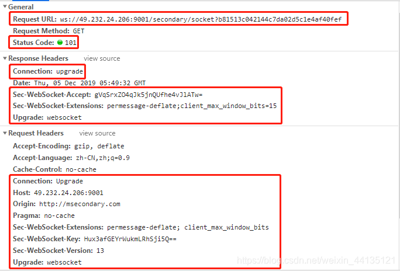

- ajax
- long poll 长轮询(Connection:keep-alive)
- iframe 长连接
- WebSocket

## 前言

在日常 Web 项目中，通常使用的是短连接。即一个 Request 对应一个 Response，发起请求后建立 TCP 连接，数据传输后连接关闭。但是对于股票信息更新、即时通讯、在线游戏这种数据交互频繁的场景就需要使用长连接。今天记录一下长连接的几种方式。

## 一、ajax 轮询

实现原理：ajax 轮询指客户端每间隔一段时间向服务端发起请求，保持数据的同步。

优点：可实现基础（指间隔时间较短）的数据更新。

缺点：这种方法也只是尽量的模拟即时传输，但并非真正意义上的即时通讯，很有可能出现客户端请求时，服务端数据并未更新。或者服务端数据已更新，但客户端未发起请求。导致多次请求资源浪费，效率低下。

## 二、long poll 长轮询

实现原理：
long poll 指的是客户端发送请求之后，如果没有数据返回，服务端会将请求挂起放入队列（不断开连接）处理其他请求，直到有数据返回给客户端。然后客户端再次发起请求，以此轮询。在 HTTP1.0 中客户端可以设置请求头 Connection:keep-alive，服务端收到该请求头之后知道这是一个长连接，在响应报文头中也添加 Connection:keep-alive。客户端收到之后表示长连接建立完成，可以继续发送其他的请求。在 HTTP1.1 中默认使用了 Connection:keep-alive 长连接。

优点：减少客户端的请求，降低无效的网络传输，保证每次请求都有数据返回，不会一直占用线程。

缺点：无法处理高并发，当客户端请求量大，请求频繁时对服务器的处理能力要求较高。服务器一直保持连接会消耗资源，需要同时维护多个线程，服务器所能承载的 TCP 连接数是有上限的，这种轮询很容易把连接数顶满。每次通讯都需要客户端发起，服务端不能主动推送。

## 三、iframe 长连接

实现原理：
在网页上嵌入一个 iframe 标签，该标签的 src 属性指向一个长连接请求。这样服务端就可以源源不断地给客户端传输信息。保障信息实时更新。

优点：消息及时传输。

缺点：消耗服务器资源。

## 四、WebSocket

实现原理：
Websocket 实现了客户端与服务端的双向通信，只需要连接一次，就可以相互传输数据，很适合实时通讯、数据实时更新等场景。

Websocket 协议与 HTTP 协议没有关系，它是一个建立在 TCP 协议上的全新协议，为了兼容 HTTP 握手规范，在握手阶段依然使用 HTTP 协议，握手完成之后，数据通过 TCP 通道进行传输。

Websoket 数据传输是通过 frame 形式，一个消息可以分成几个片段传输。这样大数据可以分成一些小片段进行传输，不用考虑由于数据量大导致标志位不够的情况。也可以边生成数据边传递消息，提高传输效率。

### 与 HTTP 的区别：
以下是一个 WebSoket 协议的请求响应报文头，与 HTTP 协议的区别是：

URL 是以 ws: 开头，如果是对应的 HTTPS，则以 wss: 开头。WebSocket 使用 ws 或 wss 为统一资源标志符，其中 wss 表示在 TLS 之上的 Websocket。

Status Code：101。该状态码表示协议切换。服务器返回了 101 ，表示没有释放 TCP 连接。WebSoket 协议握手阶段还是依赖于 HTTP 协议，到数据传输阶段便切换协议。

Conection：upgrade，表示协议升级。在 HTTP 协议中，该请求头有两个值，一个是 close ， HTTP/1.0 默认值，表示客户端或服务端想要关闭连接。另一个是 keep-alive，HTTP/1.1 默认值，表示长连接。

以下头部字段是只有 WebSocket 协议才有的字段。
#### 请求头：
Sec-WebSocket-Extension：表示客户端协商的拓展特性。
Sec-WebSocket-Key：是一个 Base64 encode 的密文，由浏览器随机生成，用来验证是否是 WebSocket 协议。
Sec-WebSocket-Version：表示 WebSocket 协议版本。

#### 响应头：
Sec-WebSocket-Extension：表示服务端支持的拓展特性。
Sec-WebSocket-Accept：与客户端的 Sec-WebSocket-Key 相对应，是经过服务器确认，加密过后的 Sec-WebSocket-Key

#### 优点：
双向通信。客户端和服务端双方都可以主动发起通讯。  
没有同源限制。客户端可以与任意服务端通信，不存在跨域问题。  
数据量轻。第一次连接时需要携带请求头，后面数据通信都不需要带请求头，减少了请求头的负荷。  
传输效率高。因为只需要一次连接，所以数据传输效率高。  

#### 缺点：
长连接需要后端处理业务的代码更稳定，推送消息相对复杂；  
长连接受网络限制比较大，需要处理好重连。  
兼容性，WebSocket 只支持 IE10 及其以上版本。  
服务器长期维护长连接需要一定的成本，各个浏览器支持程度不一；  
成熟的 HTTP 生态下有大量的组件可以复用，WebSocket 则没有，遇到异常问题难以快速定位快速解决。  
